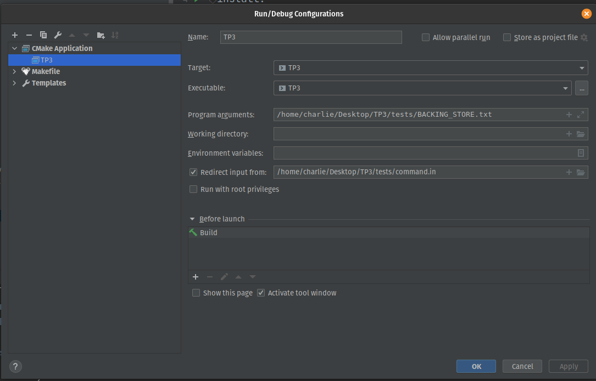

<div class="center">

# TP3 – Mémoire virtuelle

</div>

  

# Préambule

Ce TP vise à vous introduire la gestion de mémoire virtuelle. Vous aurez
a implémenter les algorithmes vus en classe.

# Introduction

Dans ce travail pratique, vous devrez implémenter en langage C un
programme qui simule un gestionnaire de mémoire virtuelle par pagination
(paging). Votre solution simulera des accès mémoire consécutifs en
traduisant les adresses logiques en adresses physiques de 16 bits dans
un espace d’adresses virtuelle (virtual address space) de taille
2<sup>16</sup> = 65536 bytes.

Votre programme devra lire et exécuter une liste de commandes sur des
adresses logiques. Pour y arriver il devra traduire chacune des adresses
logiques à son adresse physique correspondante en utilisant un TLB
(Translation Look-aside Buffer) et/ou une table de pages (page table).

# Mise en place

Le code fournit devrait être directement compatible avec Clion. Cependant,
le projet dépend des programmes *bison* et *flex* disponibles sur linux et MacOS.

Sur linux, vous pouvez les installer avec

```bash
sudo apt-get install bison flex
```

Ce TP est basé sur un projet du livre de référence utilisé dans le
cours, et il vous aidera à mettre en pratique les sections 8.5 (paging),
9.2 (demand paging) et 9.4 (page replacement).

Vous trouverez dans ces sections tous les concepts nécessaires. Pour vous
simplifier la tâche, on simulera une mémoire physique qui ne contient
que des caractères imprimables ASCII. C’est-à-dire, pour une mémoire
physique de 8KB (32 frames par 256 bytes), chacune de ses entrées
contiennent un caractère parmi les 95 caractères imprimables ASCII
possibles. Plus spécifiquement, le code fourni comprends déjà les
structures de données de base pour un gestionnaire de mémoire avec les
paramètres suivants (src/conf.h):

-   256 entrées dans la page table

-   Taille des pages et des frames de 256 bytes

-   Tout usage de matériel (code ou texte) emprunté à quelqu’un d’autre

    (trouvé sur le web, etc.) doit être dûment mentionné, sans quoi cela

    sera considéré comme du plagiat. Si pour une question votre solution

    est directement copiée, même si il y a attribution de la source,

    cette question se verra attribuée la note de zéro. Vous pourrez

    cependant l’utiliser dans les sections suivantes sans pénalité.

-   Votre devoir sera corrigé automatiquement en très grande partie. Si

    vous déviez de ce qui est demandé en output, les points que vous

    perdrez seront perdus pour de bon. Si vous n’êtes pas certains d’un

    caractère demandé, demandez, et nous répondrons de façon à ce que chaque étudiant puisse voir la réponse.

-   La méthode de développement recommandée est d’utiliser CLion et son

    intégration avec Valgrind. Si vous voulez utiliser d’autres

    techniques, vous pouvez le faire, mais nous ne vous aiderons si vous

    rencontrez des problèmes avec ces techniques.

-   8 entrées dans le TLB

-   32 frames


# Description du projet

Puisqu’on a un espace de mémoire virtuelle de taille 2<sup>16</sup> on
utilisera des adresses logiques de 16 bits qui encodent le numéro de
page et le décalage (offset).

Par exemple l’adresse logique 1081 représente la page 4 avec un décalage
(offset) de 57.

Votre programme devra lire de l’entrée standard (stdin) une liste de
commandes de lecture ou d’écriture. Vous devrez décoder le numéro de
page et l’offset correspondant et ensuite traduire chaque adresse
logique à son adresse physique, en utilisant le TLB si possible
(TLB-hit) ou la table de page dans le cas d’un TLB-miss.

# Traitement de Page Faults

Dans le cas d’un TLB-miss (page non trouvé dans le TLB), la page
demandée doit être recherchée dans la table de pages. Si elle est déjà
présente dans la table de pages, on obtient directement le frame
correspondant. Dans le cas contraire, un page-fault est produit.

Votre programme devra implémenter la pagination sur demande (section 9.2
du livre). Lorsque un page-fault est produit, vous devez lire une page
de taille 256 bytes du fichier *BACKING\_STORE.txt* et le stocker dans
un frame disponible dans la mémoire physique (au début du programme la
mémoire physique commence toujours vide).

Par exemple, si l’adresse logique avec numéro de page 15 produit un
page-fault, votre programme doit lire la page 15 depuis le
*backing store* (rapellez-vous que les pages commencent à l’index 0
et qu’elles font 256 bytes) et copier son contenu dans une frame libre
dans la mémoire physique. Une fois ce frame stocké (et que la table de
pages et le TLB sont mis à jour), les futurs accès à la page 15 seront
adressé soit par le TLB ou soit par la table de page jusqu’à ce que la
page soit déchargé de la mémoire (swapped out). 

Le fichier
*BACKING\_STORE.txt* est déjà ouvert et fermé pour vous. Il se peut que nous changions le fichier
texte qui représente le backing store lors de la correction. Vous n'avez pas à vous en souciez. Le backing store contient
65536 caractères imprimables aléatoires. Suggestion: générez des programmes aléatoires simuler des accès mémoires plus compliqués que le/les exemples donnés.

## Commandes

Les commandes que votre programme a à gérer sont automatiquement lues par les fichiers générés par
*flex* et *bison*. Les fonctions *vmm\_read* et *vmm\_write* sont
automatiquement appelées. Vous ne devriez donc vous préoccuper du
fonctionnement du programme qu’à partir de la gestion des commandes
lues.

La lecture des commandes se fait par l’entrée standard (*stdin*) et les
commandes invalides sont ignorées. Les commandes sont de la forme
suivante:

### commande d’écriture  
w&lt;*logical-address*&gt;’&lt;*char-to-write*&gt;’;  
ex: *w20’b’;*

### commande de lecture  
r&lt;*logical-address*&gt;;  
ex: *r89;*

## Points d'entrée

Pour réitérer: les points d'entrée de votre programme sont les fonctions *vmm\_read* et *vmm\_write*
de *vmm.c*. Vous pouvez les voir comme deux fonctions main.

# Travail à effectuer

Vous devez implémenter les fonctions incomplètes de *vmm.c*, *pm.c*,
*pt.c*, et *tlb.c*, y compris l’implémentation de l’algorithme de
remplacement du TLB et des frames ainsi que la gestion de l’état “dirty”
des pages.

De plus, vous devez corriger les sorties déjà définies dans les
fonctions *vmm\_read* et *vmm\_write* afin de fournir l’ensemble des
valeurs qu’il faut afficher.

Finalement, vous devez fournir 2 fichiers de tests *tests/command_tlb.in*
et *tests/command_pt.in*. Le premier devrait principalement tester
l’efficacité du TLB alors que le deuxième devrait aussi tester
l’algorithme de remplacement des pages.

## Quelques précisions

- Notez que le "readonly" mentionné à quelques endroits doit être lu au passé. "Has it been only read?". C'est un peu comme le dirty bit vu en classe, utile pour second hand etc.
- Toutes les fonctions ayant un TODO doivent être implémentées et fonctionner comme demandé. Cependant, il se peut que vous ne les utilisiez pas toutes. Ce n'est pas grave, mais nous allons quand même vérifier qu'elles marchent. (Nous ignorons complètement l'existence du readonly dans nos tests, donc pas de stress avec ça.)
- Ce TP est beaucoup plus théorique que les 3 premiers. Faites attention à la matière présentée en classe.

# Compilation

Le CMakeLists.txt fourni permet de compiler votre TP, mais
pour le rouler, il faut lui passer deux arguments: le backing store et la commande à évaluer.

Vous pouvez changer la configuration de CLion comme suit pour passer les bons arguments:



Le path sera différent pour vous, mais c'est l'idée générale.

# Barême et remise

- Votre note sera divisée équitablement entre chaque fichier C principal (pm, pt, tlb, vmm), la qualité de vos tests de TLB et de PT, et la
qualité de votre algorithme de remplacement.
- Les barèmes standards du [TPX](https://github.com/IFT2245/TPX) s'appliquent (fuites mémoires, accès illégaux, etc).
